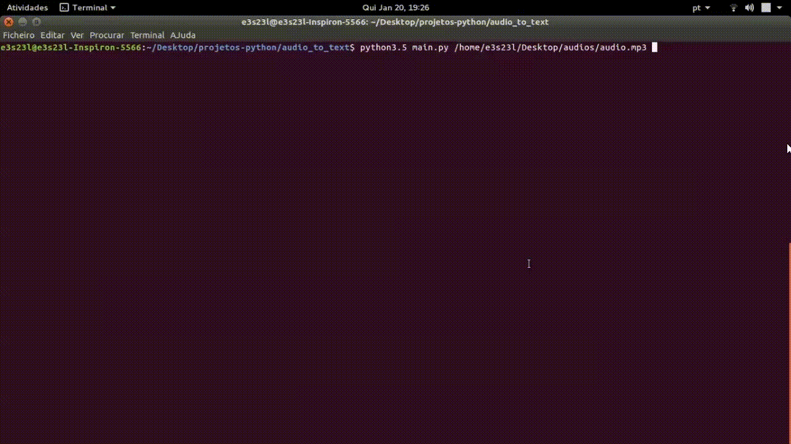
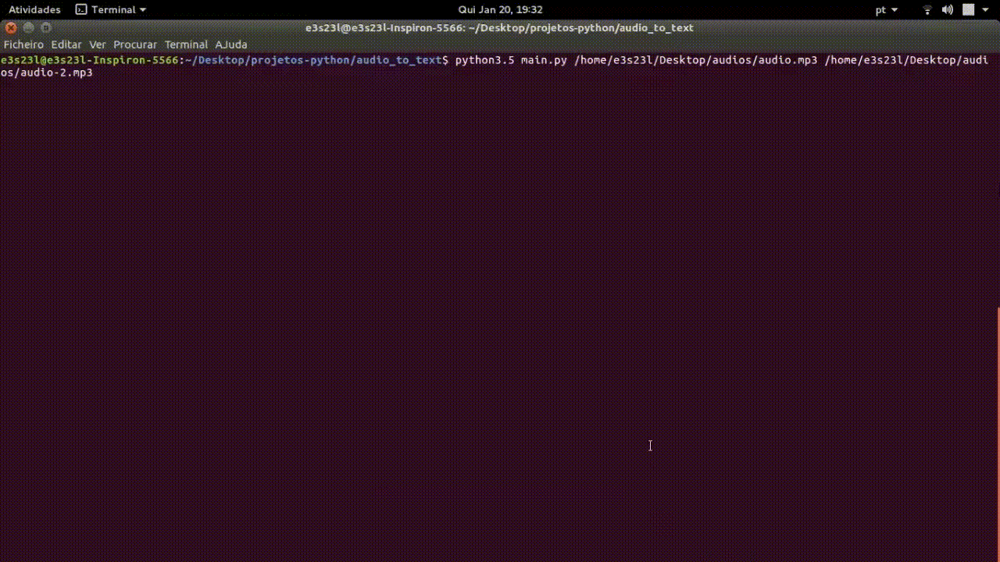
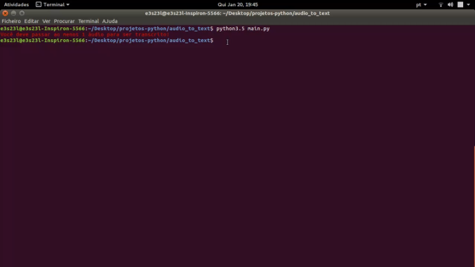
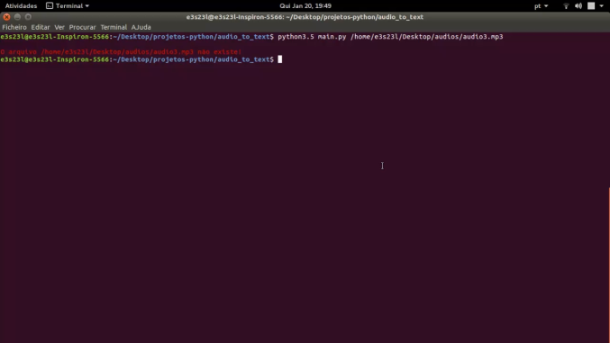
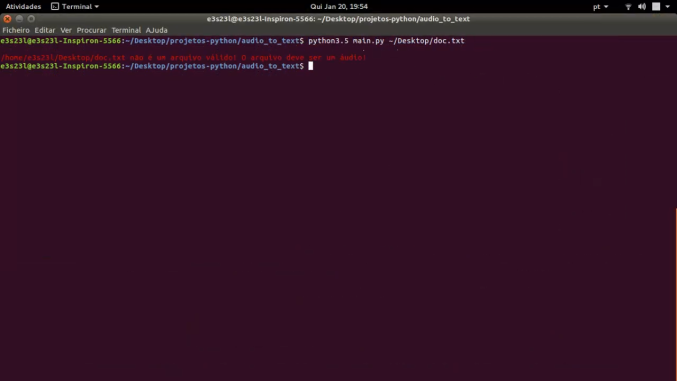
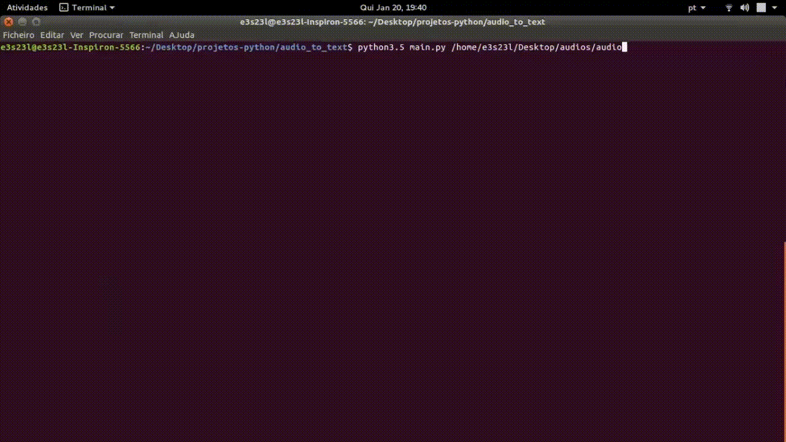
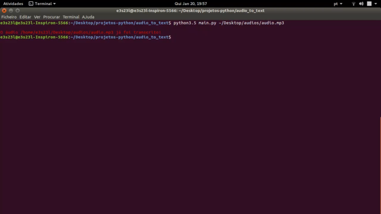

# Audio to Text

<p align="center" >
<a href="#Descrição">Descrição</a>
&nbsp;&nbsp;&nbsp;|&nbsp;&nbsp;&nbsp;
<a href="#Requisitos">Requisitos</a> &nbsp;&nbsp;&nbsp;|&nbsp;&nbsp;&nbsp;
<a href="#Instalação">Instalação</a> &nbsp;&nbsp;&nbsp;|&nbsp;&nbsp;&nbsp;
<a href="#Manual de uso">Manual de uso</a> &nbsp;&nbsp;&nbsp;|&nbsp;&nbsp;&nbsp;
<a href="#Demonstrações">Demonstrações</a>
&nbsp;&nbsp;&nbsp;|&nbsp;&nbsp;&nbsp;
<a href="#Tratamento de erros">Tratamento de erros</a> 
&nbsp;&nbsp;&nbsp;|&nbsp;&nbsp;&nbsp;
<a href="#Estratégias para diminuir o tempo de transcrição">Estratégias para diminuir o tempo de transcrição</a> 
&nbsp;&nbsp;&nbsp;|&nbsp;&nbsp;&nbsp;
<a href="#Contribuições">Contribuições</a> 
&nbsp;&nbsp;&nbsp;|&nbsp;&nbsp;&nbsp;
<a href="#Meios de contato"> Meios de contato</a> 


## Descrição

***Audio to Text*** é um programa de *CLI* desenvolvido em Python que realiza a transcrição de áudios utilizando a lib *speech recognition*.


<h1 align="center">
    
</h1>


Este programa surgiu em 2019, enquanto desenvolvia o TCC no Ensino Médio Técnico, com a finalidade de suplantar uma necessidade. Esta necessidade consistia em precisar transcrever o áudio das gravações de entrevista que tinha realizado para o TCC. Havia somente eu para transcrever as gravações, então uma transcrição manual demandaria muito tempo.

Como eu possuía conhecimentos de programação, procurei maneiras de realizar transcrição automática no **Python** e encontrei a lib *speech recognition*. A partir dessa lib, desenvolvi o programa em questão para realizar a transcrição das gravações. Nessa época, ele era muito simples, mas com o tempo, fui melhorando ele até o ponto que está hoje.

A transcrição da lib *speech recognition*, e por conseguinte do ***Audio to Text***, não é perfeita, porém, é bem mais rápido ajustes no resultado da transcrição do que transcrever tudo manualmente. Além disso, como você verá nos tópicos abaixo, o funcionamento do programa é bem robusto, o que significa que para ele ficar ótimo basta alterar a ferramenta de conversão de áudio em texto.


## Requisitos

- Python 3.5


**Obs. 1:** Pode ser que a versão das libs que são utilizadas funcionem da mesma maneira em *Python* 3.x de modo geral, mas, não cheguei a testar, então, não garanto que o *Audio to Text* funcione corretamente para Python 3.x como um todo.

**Obs. 2:** *Audio to Text* foi desenvolvido e testado no Ubuntu. Em momento nenhum, ele foi testado no *Windows*, *Mac* nem em outras distros *Linux*, portanto, não tenho como garantir que este programa funciona corretamente em outros SO.


## Instalação

Para instalar primeiramente clone na pasta que você desejar o repositório do "projetos python" que está no *GitHub*. Como os arquivos de *Audio to Text* estão dentro do repositório "projetos python", não é possível ter um clone com somente os arquivos do programa em questão.

```shell
git clone https://github.com/EmanuelLacerda/projetos-python
```


Depois entre, via terminal, na pasta raiz do *Audio to Text* por meio do comando abaixo.

```shell
cd projetos-python/audio-to-text
```


Agora que está dentro da pasta raiz, instale as libs necessárias por meio do comando pip.

```shell
pip install -r requirements.txt
```


Agora é só executar o programa. No próximo tópico será apresentado o manual de uso.


## Manual de uso

Antes de iniciar esse tópico acredito ser importante apontar que neste tópico não será apresentado *gifs* do programa funcionando. Essas apresentações estão no próximo tópico.

Antes de executar os comandos abaixo é necessário entrar, via terminal, na pasta em que estão os códigos do *Audio to Text*.

```shell
cd [caminho-da-pasta-em-que-esta-os-codigos-do-programa]
```


Isso é necessário devido à maneira como é especificada em código a localização das subpastas da pasta raiz *Audio to Text*. Porém, você pode alterar o código para não precisar executar esse comando todas as vezes. Abaixo há a explicação de como realizar essa alteração.

O primeiro passo é entrar no arquivo variaveis_globais.py e procurar pelas constantes "PASTA_CORTES" e "PASTA_TRANSCRICOES". A primeira constante armazena o caminho da pasta "cortes/". Já a segunda, armazena o caminho da pasta "transcricoes/". Ambas são subpastas da pasta raiz.

Então, basta substituir o valor dessas duas constantes para, respectivamente, o caminho exato da subpasta "cortes/" no seu computador e o caminho exato da subpasta "transcricoes/" também no seu computador. Só lembrar de alterar novamente caso mude a localização da pasta raiz.

A maneira de transcrever um áudio utilizando *Audio to Text* é executando o comando abaixo em seu terminal.

```shell
python3.5 main.py [caminho-do-audio-que-sera-transcrito]
```


Se quiser transcrever mais de um áudio em uma única execução, também é possível. Para isso, basta colocar depois de "main.py" o caminho de cada áudio com um espaço entre cada caminho.

```shell
python3.5 main.py [caminho-do-audio-1-que-sera-transcrito] [caminho-do-audio-2-que-sera-transcrito] ... [caminho-do-audio-n-que-sera-transcrito]
```


Quando a transcrição do(s) arquivo(s) finalizar, basta ir na subpasta "transcricoes/" e, em seguida, copiar para a pasta desejada o documento contendo a transcrição de cada arquivo transcrito. O nome do documento que contém a transcrição de um dado arquivo de áudio será  "doc_de_transcricao_de_identificador_do_audio.odt". O identificado do áudio é composto por o nome da pasta em que está o áudio, o nome do áudio e a extensão do áudio, com um "_" entre as palavras.

No método montar_identificador_do_audio da classe ExtracaoDoNomeDoAudio que está presente no arquivo transcricoes.py, há a explicação do motivo do identificador ser composto por essas informações. Antes é recomendado ler o tópico **"Estratégias para diminuir o tempo de transcrição"**.


**Obs. 1** Não obrigatoriamente o usuário terá que utilizar o comando "python3.5". Ele deve utilizar o comando que executa o código *python* na versão 3.5 do mesmo. Em relação a utilizar uma versão do *Python* que é diferente da 3.5 para executar o *Audio to Text*, leia as observações do tópico **"Requisitos"**.

**Obs. 2:** Para uma melhor experiência do usuário, é essencial que nenhum dos arquivos da subpasta "transcricoes/" seja deletado, apenas copiado para outra pasta. A leitura do tópico **"Estratégias para diminuir o tempo de transcrição"** tornará  claro o motivo de deletar arquivos de "transcricoes/"  prejudicar a sua experiência como usuário.

**Obs. 3:** Eu uso o *LibreOffice* e prefiro que o documento de transcrição seja um arquivo *LibreOffice Write*. Caso você não use o *LibreOffice* e/ou não queira que a extensão deste documento seja ".odt", basta ir até o método montar_nome_do_documento_contendo_a_transcricao_do_corte da classe Transcricoes que está presente no arquivo transcricoes.py. Dentro deste método, altere ".odt" pela extensão que for mais adequada para você. Só lembrando que esta nova extensão deve ser uma extensão de texto.


## Demonstrações

Conforme pode ser visto nos gifs abaixo, a transcrição de um arquivo de áudio passa pelas seguintes etapas:

1. Cortar o áudio em áudios de 1 minuto ou menos.
2. Exportar cada um dos cortes para "cortes/".
3. Transcrever cada corte salvando o resultado da transcrição em documentos específicos. Estes documentos ficam em "transcricoes/". O nome que eles recebem é derivado do nome do seu respectivo corte.
4. Salvar o conteúdo de cada um dos documentos em um único documento que também ficará em "transcricoes/". Assim como no documento que contém a transcrição de um corte, esse documento terá como nome uma derivação do nome do áudio transcrito.

O processo de transcrever um áudio é um processo demorado. Devido a isso, é importante dar um feedback ao usuário que deixe claro para ele se o processo está demorando por um travamento no programa ou por o processo ser demorado.

A maneira mais básica de fazer é imprimir no terminal o que está sendo feito agora. Porém, só imprimir não é o bastante, pois não mostra ao usuário o quão perto está de terminar a etapa atual. Portanto, é necessário imprimir qual etapa está sendo executada agora e, em tempo real, ir apresentando qual a porcentagem daquela etapa que já foi concluída.

Optei por mostrar essa porcentagem por meio de uma *progress bar*(barra de progresso, em português) com a finalidade de aproximar a interface de linha de comando a uma interface gráfica. A progress bar está sendo mostrada no terminal graças a lib "*tqdm*".


**Transcrição de um único arquivo de áudio:**

<h1 align="center">
    
</h1>


**Transcrição de dois ou mais arquivos de áudio:**

<h1 align="center">
    
</h1>


## Tratamento de erros

Na hora de passar os parâmetros o usuário pode, inconscientemente ou conscientemente, passar incorretamente um ou mais parâmetros. Os erros que o usuário pode cometer na passagem de parâmetros são os listados abaixo:

- Passar nenhum parâmetro(E1).
- Passar um arquivo de áudio que não existe(E2).
- Passar um parâmetro que não é um arquivo de áudio(E3).

No caso do E2 e do E3, o programa não vai transcrever os parâmetros que se encaixarem em um desses erros, porém, o fato de um ou mais parâmetros serem E2 ou E3, não impedirá a transcrição dos parâmetros que forem válidos.

Abaixo há a demonstração da mensagem de erro para cada um dos 3 erros acima.

**Mensagem de erro para E1:**

O print abaixo mostra qual a mensagem de erro que é mostrada quando ocorre o E1. Como é um erro, optei por colocar o texto em vermelho seguindo o padrão de mensagens de erros serem mostradas nessa cor. A mensagem de erro para o E1 é "Você deve passar ao menos 1 áudio para ser transcrito!".

<h1 align="center">
    
</h1>


**Mensagem de erro para E2:**

O print abaixo mostra qual a mensagem de erro que é mostrada quando ocorre o E2. Como é um erro, optei por colocar o texto em vermelho seguindo o padrão de mensagens de erros serem mostradas nessa cor. A mensagem de erro para o E2 é "O arquivo [caminho-do-arquivo-passado-nos-parametros] não existe!".

<h1 align="center">
    
</h1>


**Mensagem de erro para E3:**

O print abaixo mostra qual a mensagem de erro que é mostrada quando ocorre o E3. Como é um erro, optei por colocar o texto em vermelho seguindo o padrão de mensagens de erros serem mostradas nessa cor. A mensagem de erro para o E3 é "[caminho-do-arquivo-passado-nos-parametros] não é um arquivo válido! O arquivo deve ser um áudio!".

<h1 align="center">
    
</h1>


## Estratégias para diminuir o tempo de transcrição

Pode acontecer de um áudio passado como parâmetro já ter sido em parte ou totalmente transcrito. Nestes casos, é importante que o programa de transcrição consiga distinguir quais trechos já foram e quais trechos ainda não foram transcritos.

Conseguindo distinguir ambos, o programa vai gastar tempo computacional somente com os trechos  que realmente precisam ser transcritos. Dessa maneira, o tempo computacional gasto com um áudio parcialmente ou totalmente já transcrito vai ser menor do que o gasto com um áudio 0% transcrito.

O *Audio to Text* consegue realizar essa distinção para áudios parcialmente e para áudios totalmente transcritos conforme as explicações abaixo.


### Áudios parcialmente transcritos

Antes de apresentar a parte sobre os parcialmente transcritos, um *disclaimer*. Para entender a explicação abaixo é necessário conhecer o processo de transcrição de um áudio que o *Audio to Text* segue. Este processo é apresentado no tópico **"Demonstrações"**.

Por o motivo que seja, pode acontecer da transcrição ser interrompida antes do fim dela. Ou seja, o áudio vai está somente parcialmente transcrito. Precisar colocar o áudio para transcrever tudo novamente será muito frustrante para o usuário, principalmente se esse áudio for grande. Pensando nisso, este programa foi codificado para evitar esse tipo de frustração.

Relembrando, o nome do documento que armazena a transcrição de um corte é derivado do nome do seu respectivo corte. Baseado nisso, o programa pode executar dois passos para verificar se cada corte já foi transcrito.

O primeiro passo é construir o nome do documento que receberá o resultado da transcrição do corte atual. O segundo é verificar se em "transcricoes/" já existe ou não um arquivo de mesmo nome.

Se existir, significa que o corte já foi transcrito. Como já existe, o programa imprime a mensagem dizendo que o corte já foi transcrito e passa para a transcrição do próximo corte. Se não, realiza a transcrição do corte atual.

Dessa maneira, quando o usuário reexecutar o transcritor para finalização da transcrição, só serão transcritos os cortes que não tinham sido transcritos antes da interrupção. Ainda vai ser um tempo maior que seria se não tivesse ocorrido a interrupção, já que há a demora para a transcrição iniciar, para cortar os áudios e para fazer as verificações novamente, porém, é  mais rápido do que se fosse necessário transcrever todos os cortes novamente, principalmente, se for um arquivo de áudio grande.

Para o *Audio to Text* conseguir realizar o que foi apresentado acima, é necessário que nenhum dos documentos presentes em "transcricoes/" seja removido. Se algum deles for removido, transcrições feitas anteriormente precisarão ser refeitas. Porém, se o objetivo for retranscrever totalmente ou parcialmente o áudio, não há problemas em remover.

O *gif* abaixo demonstra o que foi explicado acima. No caso do *gif* abaixo, há um áudio de 6 minutos que 4 minutos já foram transcritos. Por meio do mecanismo explicado acima, o *Audio to Text* consegue identificar que os primeiros 4 minutos já foram transcritos, então, transcreve apenas os 2 últimos minutos do áudio.

<h1 align="center">
    
</h1>


### Áudios totalmente transcritos

Antes de apresentar a parte sobre os totalmente transcritos, um disclaimer. Para entender a explicação abaixo é necessário conhecer o processo de transcrição de um áudio que o *Audio to Text* segue. Este processo é apresentado no tópico **"Demonstrações"**.

Pode acontecer do usuário se enganar colocando um áudio totalmente transcrito para ser transcrito novamente. Para esse caso, a solução para áudios parcialmente transcritos  já seria suficiente. Porém, é possível fazer uma solução ainda mais específica para este caso.

Se o áudio já foi totalmente transcrito, é interessante utilizar uma maneira que com uma única verificação já se sabe se o áudio já foi ou não completamente transcrito, ao invés de ter que verificar corte por corte se já foi transcrito.

Como explicado em **"Demonstrações"**, após todos os cortes serem transcritos, o resultado da transcrição de cada corte é adicionado em um único arquivo. Relembrando, o nome deste arquivo é derivado do nome do arquivo de áudio que foi transcrito.

Então, o programa faz a mesma coisa descrita no subtópico anterior agora levando em conta o nome do arquivo de áudio. Dessa maneira, uma única verificação é suficiente para saber se o arquivo de áudio já foi ou não totalmente transcrito.

O print abaixo mostra qual a mensagem mostrada quando o áudio passado como parâmetro já foi transcrito. Não tenho total certeza se o usuário passar para ser transcrito um arquivo de áudio que já foi transcrito pode ser classificado como erro, porém, optei por colocar na cor vermelha. A mensagem presente no print abaixo é "O arquivo [caminho-do-arquivo-passado-nos-parametros] já foi transcrito!".

<h1 align="center">
    
</h1>


## Contribuições

Hoje meu foco é frontend. Devido a isso, não consigo, no momento, me dedicar tanto a esse e os outros projetos que desenvolvi anteriormente com *Python*. Porém, se você encontrar algum erro ou tiver algum problema com o uso do mesmo, pode abrir um issues aqui e me avisar por um dos meios de contato que vou deixar abaixo. Resolverei o *issues* o mais cedo que for possível.

Se quiser fazer a sua própria versão do *Audio to Text* e libera-la aqui no *GitHub*, sinta-se à vontade. Só peço que no README deixe claro que você se baseou neste. Também peço que me avise no caso de você fazer uma outra versão do *Audio to Text*. Gostarei de vê os projetos baseado neste.


## Meios de contato

Se quiser conversar comigo sobre este projeto ou sobre outras questões, pode entrar em contato por os meios abaixo:

- **LinkedIn:** https://www.linkedin.com/in/emanuel-de-souza-lacerda/
- **E-mail:** emanuelsouzalacerda@gmail.com